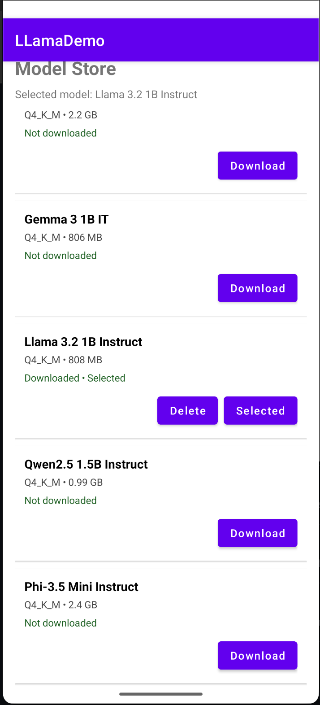
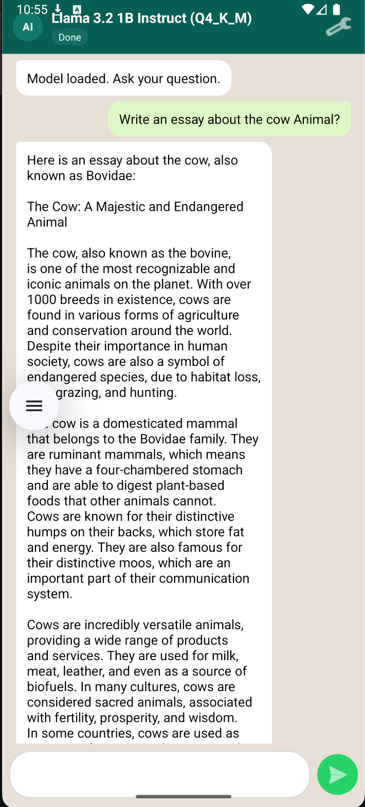
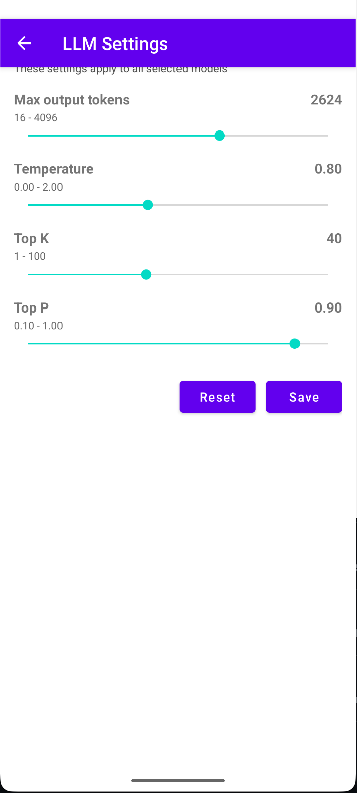

# llama-jni-android-chat (Android llama.cpp JNI Wrapper)

Java + XML + ViewBinding Android app that runs local GGUF LLMs using a JNI bridge to `llama.cpp`.

This repository includes:

- A curated in-app model catalog (`assets/models_catalog.json`)
- In-app model downloads via `DownloadManager`
- Persistent model state and selected model via `SharedPreferences`
- Chat UI with prompt templates per model family
- Runtime LLM settings (max tokens, temperature, top-k, top-p)
- Native inference through JNI (`io-prompt` and `interactive`)

## Upstream Base

- Original JNI wrapper base repo: [shixiangcap/llama-jni](https://github.com/shixiangcap/llama-jni)
- Core inference engine: [ggerganov/llama.cpp](https://github.com/ggerganov/llama.cpp)
- Current vendored llama.cpp sync marker in this repo:
  - `app/src/main/cpp/scripts/sync-ggml.last`: `d6754f3d0e6d0acd21c12442353c9fd2f94188e7`

## Tech Stack

- Android: Java, XML layouts, ViewBinding
- Native: C/C++ (`llama.cpp`) via CMake + NDK
- Build: Gradle / Android Studio
- Min SDK: 30
- Target SDK: 35
- App ID: `com.hcltech.llamademo`
- ABI currently configured: `arm64-v8a`

## Project Structure

```text
app/
  src/main/java/com/sx/llama/jni/
    ModelStoreActivity.java        # model list + download/select/delete
    ChatActivity.java              # chat flow + JNI inference calls
    ChatSettingsActivity.java      # runtime parameter settings
    ModelCatalogLoader.java        # models_catalog.json parser
    ModelDownloadHelper.java       # DownloadManager wrapper
    ModelStateStore.java           # model state SharedPreferences
    LlmSettingsStore.java          # inference settings SharedPreferences
    PromptTemplateEngine.java      # model-family prompt formatting
    MainActivity.java              # JNI method declarations (bridge)
  src/main/assets/
    models_catalog.json            # curated model list
  src/main/cpp/
    CMakeLists.txt
    examples/io-prompt/io-prompt.cpp
    examples/interactive/...
```

## Prerequisites

Install from Android Studio SDK Manager:

- Android SDK Platform 35
- Android SDK Build-Tools
- NDK (Side by side)
- CMake
- LLDB (optional)

Recommended emulator:

- API 35/36
- `arm64-v8a` system image (required by current ABI filter)

## Quick Start

1. Clone and open in Android Studio.
2. Sync Gradle.
3. Build:
   ```bash
   ./gradlew :app:assembleDebug
   ```
4. Run on an `arm64-v8a` emulator/device.
5. In app:
   - Open **Model Store**
   - Download a model
   - Select it
   - Open chat and send prompt

## Screenshots

### Model Selection


### Chat Screen


### Settings


## Model Storage

Downloaded models are saved to:

```text
getExternalFilesDir(null)/models/<filename>.gguf
```

Typical resolved path:

```text
/storage/emulated/0/Android/data/com.hcltech.llamademo/files/models/<filename>.gguf
```

## `models_catalog.json` Format

File location:

```text
app/src/main/assets/models_catalog.json
```

Root shape:

```json
{
  "version": 1,
  "updated_at": "YYYY-MM-DD",
  "models": []
}
```

Each model entry:

```json
{
  "id": "unique-model-id",
  "name": "Display Name",
  "publisher": "Publisher",
  "format": "gguf",
  "quant": "Q4_K_M",
  "prompt_format": "llama3_instruct",
  "file": {
    "filename": "model-file.gguf",
    "size_bytes": 1234567890,
    "url": "https://..."
  }
}
```

## How To Add a New Model

1. Add an item to `app/src/main/assets/models_catalog.json`.
2. Ensure `file.filename` ends with `.gguf`.
3. Ensure `file.url` is a direct downloadable GGUF URL.
4. Set correct `prompt_format` so the model receives proper chat template.
5. Rebuild and run.

Supported `prompt_format` values:

- `plain`
- `llama3_instruct`
- `qwen_chatml`
- `gemma_turn`
- `phi3_chat`

If `prompt_format` is omitted, app uses heuristic fallback from model id/name.

## Runtime Inference Settings

Open chat screen top-right settings button to configure:

- Max output tokens (16..4096)
- Temperature (0.0..2.0)
- Top-K (1..100)
- Top-P (0.1..1.0)

Settings are global and persisted in `SharedPreferences`.

## JNI Surface

Defined in `app/src/main/java/com/sx/llama/jni/MainActivity.java`:

- `createIOLLModel(String modelPath, int maxTokens)`
- `updateIOLLParams(long modelPtr, int maxTokens, float temperature, int topK, float topP)`
- `runIOLLModel(long modelPtr, String prompt)`
- `releaseIOLLModel(long modelPtr)`

## Logging

Main log tags:

- `ModelStore`
- `ModelDownload`
- `ModelStateStore`
- `ModelChat`
- `llama-io-prompt`

Useful for diagnosing download issues, model load failures, and inference behavior.

## Known Notes

- Large models can fail on emulator due to virtual storage limits (`ERROR_INSUFFICIENT_SPACE`).
- Current ABI filter is `arm64-v8a`; use matching emulator/device image.
- JNI `runIOLLModel` path is non-streaming at native call level; UI streams chunked text rendering after full response arrives.

## License

This project is MIT licensed. See [LICENSE.txt](./LICENSE.txt).

Additional third-party attribution is in [NOTICE.md](./NOTICE.md).

## Contributing

Please read [CONTRIBUTING.md](./CONTRIBUTING.md), [CODE_OF_CONDUCT.md](./CODE_OF_CONDUCT.md), and [SECURITY.md](./SECURITY.md).
